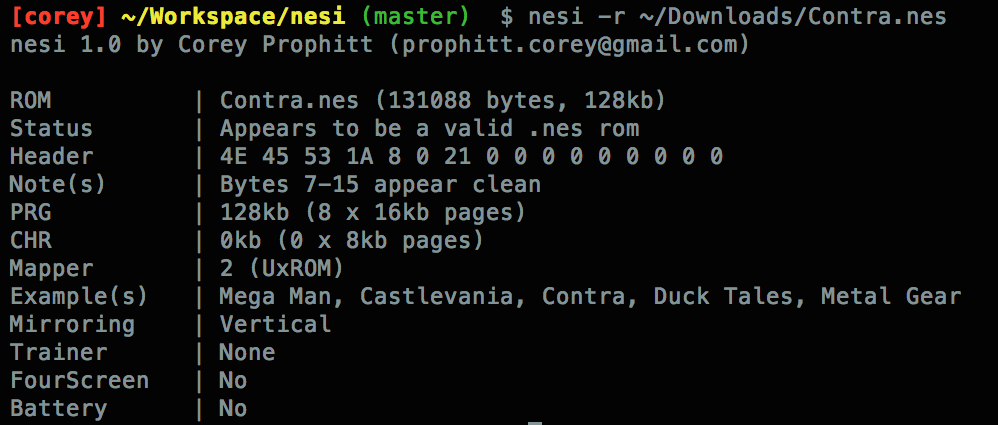

nesi
====

[](https://travis-ci.org/prophittcorey/nesi)
[](http://badge.fury.io/py/nesi)

A rom hacking tool for the analysis of *.nes* rom images.

Nesi may be useful for rom hackers or emulator developers. The `file` utility
on Linux provides *some* information on `.nes` rom files, but not enough. Nesi
was created to provide additional information.



Requirements
------------

1. `Python 2.7` or `Python 3.0+` should suffice

Installation
------------

The easiest way to install *nesi* is via PyPi, this can be done with the
following command:

```bash
$ pip install nesi
```

Note, sudo may or may not be required depending on your environment.

The second way to install is by cloning the repository and installing the
development version of the pip package:

```bash
$ git clone https://github.com/prophittcorey/nesi.git
$ cd nesi
$ make install
```

The pip package installs the nesi executable as well as the nes package which
can be used to write your own scripts.

Note, you may have to source your shell for the *nesi* executable to be picked
up.

Usage
-----

Nesi is a command line application. The basic usage can be found below:

    usage: nesi [-h] [-r ROM] [-v]

    Specify a .nes rom image to be analyzed

    optional arguments:
      -h, --help         show this help message and exit
      -r ROM, --rom ROM  path to a .nes rom image to be analyzed
      -v, --version      show the current nesi version

License
-------

    A rom hacking tool for the analysis of .nes rom images.
    Copyright (C) 2015, Corey Prophitt.

    This program is free software: you can redistribute it and/or modify
    it under the terms of the GNU General Public License as published by
    the Free Software Foundation, either version 3 of the License, or
    (at your option) any later version.

    This program is distributed in the hope that it will be useful,
    but WITHOUT ANY WARRANTY; without even the implied warranty of
    MERCHANTABILITY or FITNESS FOR A PARTICULAR PURPOSE.  See the
    GNU General Public License for more details.

    You should have received a copy of the GNU General Public License
    along with this program.  If not, see <http://www.gnu.org/licenses/>.

